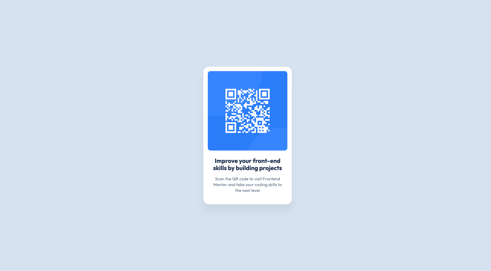

# QR Code Component

A responsive QR code component built as part of the [Frontend Mentor](https://www.frontendmentor.io/challenges/qr-code-component-iux_sIO_H) challenge.

## Overview

This project showcases a clean, centered QR code card component with responsive design and modern CSS practices.

### Screenshot



### Links

- Solution URL: [GitHub Repository](https://github.com/hakan-kemal/qr-code-component)
- Live Site URL: [Netlify Deployment](https://qr-code-component-hk.netlify.app/)

## My Process

### Built With

- Semantic HTML5 markup
- CSS custom properties
- Flexbox
- Mobile-first workflow
- [Outfit](https://fonts.google.com/specimen/Outfit) - Google Font

### What I Learned

This project reinforced several key concepts:

**CSS Custom Properties for Maintainability:**

```css
:root {
  --color-slate-900: hsl(218, 44%, 22%);
  --spacing-200: 1rem;
  --radius-base: 1.25rem;
}
```

**Strategic use of rem units:** By keeping the base font-size at 16px instead of the style guide's 15px, I maintained clean rem calculations for spacing (1rem = 16px), while still achieving the 15px paragraph size using `0.9375rem`.

**Performance optimization:** Used `fetchpriority="high"` on the QR code image and `preconnect` for Google Fonts to improve load times.

### Continued Development

Areas I want to focus on in future projects:

- Advanced CSS Grid layouts
- CSS animations and transitions
- Accessibility best practices
- Progressive enhancement techniques

### Useful Resources

- [MDN Web Docs](https://developer.mozilla.org/) - Comprehensive web development documentation
- [CSS-Tricks](https://css-tricks.com/) - Great resource for CSS techniques
- [Google Fonts](https://fonts.google.com/) - Font selection and optimization

## Author

- Frontend Mentor - [@hakan-kemal](https://www.frontendmentor.io/profile/hakan-kemal)
- GitHub - [@hakan-kemal](https://github.com/hakan-kemal)

## Acknowledgments

Thanks to Frontend Mentor for providing this challenge and the design specifications.
